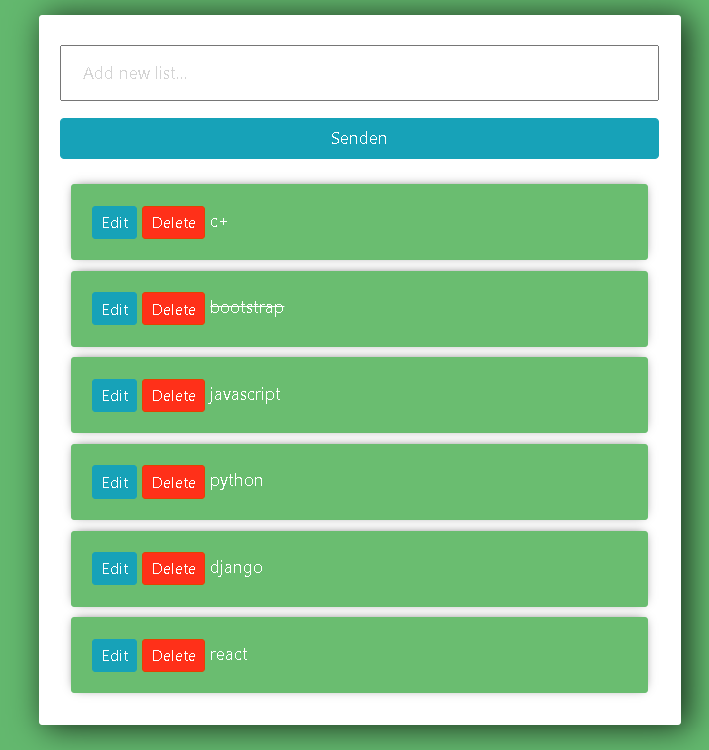
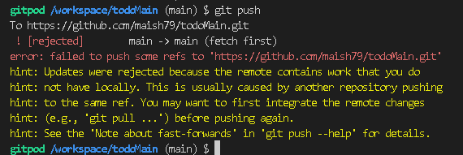

# TODO APP

* The Todo App is a task managing web application to help its users to stay organizes for their day to day activities.
* The Todo App can be used for multiole purposes such as taking notes,planing an event etc..

# Techologies Used
* HTML
* CSS
* Python
* Django
* Bootstrap

# UX/UI

* The todo app was created using a user friendly UI and agile approach.
* In the to to list one can add a task, edit, mark as complete and delete a task.

# Deployment
* The project's repo was hosted on github and was deployed on heroku.
* Here are the steps:-

1. Create a Heroku App
2. Attach the PostgresSQL database
3. Prepare environmaet and settings.py
4. Set up Cloudinary for static files
5. Connect Heroku To GitHub
6. Set up automatic deployment

# Credits
## Content

* Code Institute walkthrough projects "Hello django"

# Testing

* CSS Code passed using W3C CSS Validator.
* 

